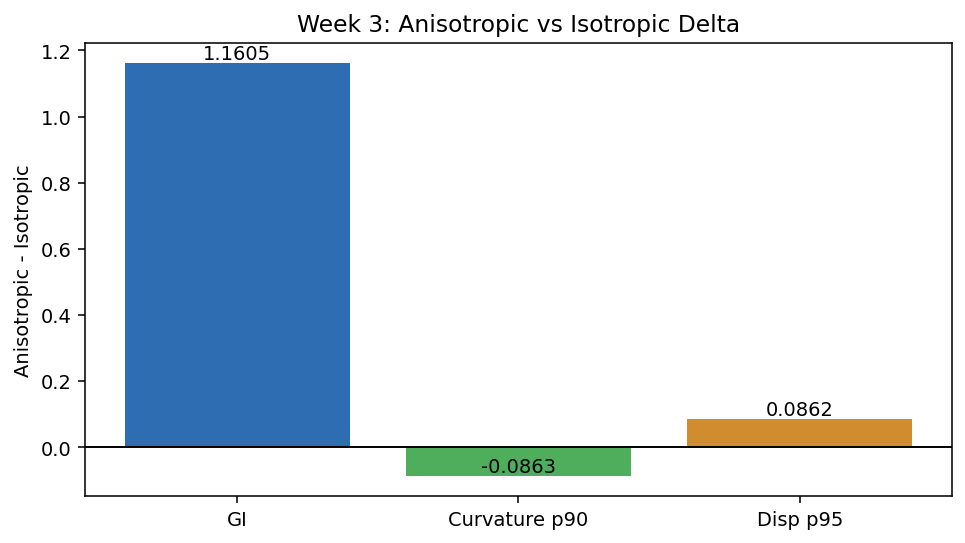
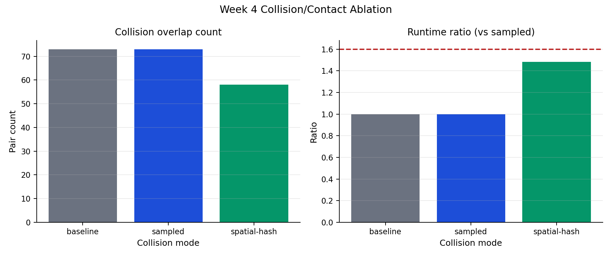
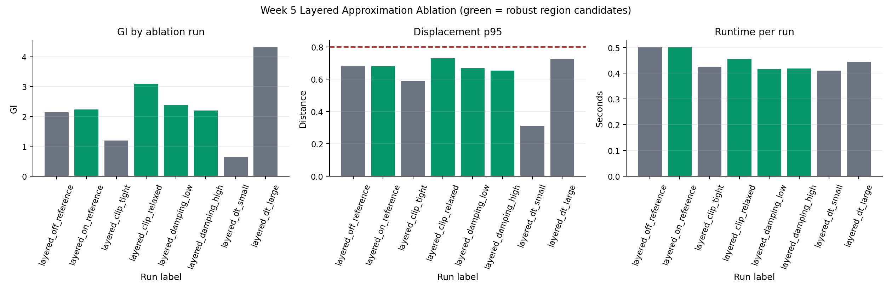

# Differentiable Cortical Folding Simulator

[](https://www.python.org/downloads/)
[](#testing)
[](https://github.com/jax-ml/jax)

A research-focused simulator for cortical folding that is differentiable end-to-end in JAX.

It supports both:

1. Forward simulation (growth parameters -> folded surface)
2. Inverse optimization (target folded surface -> recovered growth field)

## At A Glance

| Item | Details |
|---|---|
| Core stack | JAX, Equinox, Optax, NumPy, Matplotlib |
| Language | Python 3.11+ |
| Main output | Folded cortical surface trajectories + growth recovery |
| Current validation | Unit tests + synthetic benchmarks |
| Research mode | Methods + synthetic validation with roadmap to real-data pilot |

## Key Features

1. Differentiable mesh-based mechanics (elastic + bending + constrained growth)
2. `lax.scan` simulation loop with checkpointing for scalable backpropagation
3. Growth-field neural network (`GrowthFieldNet`) for inverse fitting
4. Reproducible forward parameter sweep with CSV/JSON outputs
5. Visualization utilities for trajectories, growth maps, and curvature maps

## Quickstart

### 1. Install

```bash
python3.11 -m pip install -e '.[dev]'
```

### 2. Run tests

```bash
python3.11 -m pytest tests -q
```

### 3. Run simulation demos

```bash
MPLBACKEND=Agg python3.11 scripts/demo_sphere.py
MPLBACKEND=Agg python3.11 scripts/run_forward.py
MPLBACKEND=Agg python3.11 scripts/train_inverse.py
MPLBACKEND=Agg python3.11 scripts/animate_forward.py --output forward_simulation.gif --rotate
```

## Reproducible Research Commands

### Forward sweep benchmark

```bash
MPLBACKEND=Agg python3.11 scripts/run_forward_sweep.py --n-steps 120
```

Generated artifacts:

1. `results/forward_sweep.csv`
2. `results/forward_sweep_summary.json`
3. `results/forward_sweep_manifest.json`
4. `results/validation_gate_report.json` (after gate check)

### Full forward sweep grid

```bash
MPLBACKEND=Agg python3.11 scripts/run_forward_sweep.py \
  --config-path configs/forward_sweep_baseline.json \
  --n-steps 200 \
  --output-manifest results/forward_sweep_manifest.json

python3.11 scripts/check_forward_sweep_gates.py \
  --input-csv results/forward_sweep.csv \
  --input-summary results/forward_sweep_summary.json \
  --gate-config configs/validation_gates_default.json \
  --output-report results/validation_gate_report.json \
  --fail-on-failure
```

### CI command presets

```bash
./scripts/run_validation_quick.sh
./scripts/run_validation_full.sh
```

### Week 3 anisotropy comparison

```bash
MPLBACKEND=Agg python3.11 scripts/run_anisotropy_comparison.py --n-steps 120
MPLBACKEND=Agg python3.11 scripts/plot_week3_anisotropy.py
```

Generated artifacts:

1. `results/week3_anisotropy_ab.csv`
2. `results/week3_anisotropy_ab_summary.json`
3. `results/week3_anisotropy_ab_manifest.json`
4. `results/week3_anisotropy_comparison.json`
5. `docs/assets/week3_anisotropy_delta.png`

### Week 4 collision/contact ablation

```bash
MPLBACKEND=Agg python3.11 scripts/run_week4_collision_ablation.py --n-steps 140
MPLBACKEND=Agg python3.11 scripts/plot_week4_collision.py
```

Generated artifacts:

1. `results/week4_collision_ablation.csv`
2. `results/week4_collision_ablation_summary.json`
3. `results/week4_collision_ablation_manifest.json`
4. `results/week4_collision_comparison.json`
5. `docs/assets/week4_collision_ablation.png`

### Week 5 layered approximation + core ablations

```bash
MPLBACKEND=Agg python3.11 scripts/run_week5_layered_ablation.py --n-steps 140
MPLBACKEND=Agg python3.11 scripts/plot_week5_layered_ablation.py
MPLBACKEND=Agg python3.11 scripts/validate_week5_hardened.py --n-steps 140
```

Generated artifacts:

1. `results/week5_layered_ablation.csv`
2. `results/week5_layered_ablation_summary.json`
3. `results/week5_layered_ablation_manifest.json`
4. `results/week5_layered_comparison.json`
5. `results/week5_hardened_validation.json`
6. `results/week5_matrix_check.csv`
7. `docs/assets/week5_layered_ablation.png`

### Week 6 figure pipeline standardization

```bash
MPLBACKEND=Agg python3.11 scripts/regenerate_week6_figures.py --n-steps 140
MPLBACKEND=Agg python3.11 scripts/validate_week6_hardened.py --n-steps 140
```

Generated artifacts:

1. `docs/assets/week3_anisotropy_delta.meta.json`
2. `docs/assets/week4_collision_ablation.meta.json`
3. `docs/assets/week5_layered_ablation.meta.json`
4. `docs/assets/week6_figure_manifest.json`
5. `results/week6_figure_pipeline_summary.json`
6. `results/week6_hardened_validation.json`
7. `results/week6_matrix_check.csv`

### Week 7 animation comparison pack + results index

```bash
MPLBACKEND=Agg python3.11 scripts/regenerate_week7_animation_pack.py --n-steps 140
MPLBACKEND=Agg python3.11 scripts/validate_week7_hardened.py --n-steps 140
```

Generated artifacts:

1. `docs/assets/week7_baseline_vs_improved.gif`
2. `docs/assets/week7_baseline_vs_improved.mp4`
3. `docs/assets/week7_baseline_vs_improved.meta.json`
4. `docs/assets/week7_animation_manifest.json`
5. `docs/results_index.md`
6. `results/week7_animation_comparison_summary.json`
7. `results/week7_animation_pack_summary.json`
8. `results/week7_results_index_summary.json`
9. `results/week7_hardened_validation.json`
10. `results/week7_matrix_check.csv`

## Visualization Outputs

The current repository already includes generated sample outputs:

1. `docs/assets/forward_simulation.png`
2. `docs/assets/growth_field.png`
3. `docs/assets/inverse_training_loss.png`
4. `docs/assets/growth_comparison.png`
5. `docs/assets/forward_simulation.gif` (generated via `scripts/animate_forward.py`)

| Forward Folding | Growth Field |
|---|---|
|  |  |

| Inverse Training Loss | Growth Comparison |
|---|---|
|  |  |









## Robustness Features

The solver now includes configurable numerical safety rails:

1. Per-vertex clipping for force, acceleration, velocity, and step displacement
2. Growth-rate and rest-geometry lower/upper bounds
3. Finite-value guards that fall back to the previous state on numerical overflow
4. Optional self-collision penalty via sampled pairs or spatial-hash neighborhoods with deterministic fallback
5. Trajectory subsampling (`save_every`) for memory-aware long simulations

## Project Layout

```text
.
├── src/cortical_folding/
│   ├── mesh.py
│   ├── physics.py
│   ├── constraints.py
│   ├── solver.py
│   ├── growth_net.py
│   ├── losses.py
│   ├── synthetic.py
│   └── viz.py
├── scripts/
│   ├── demo_sphere.py
│   ├── run_forward.py
│   ├── run_forward_sweep.py
│   ├── run_anisotropy_comparison.py
│   ├── plot_week3_anisotropy.py
│   ├── train_inverse.py
│   └── animate_forward.py
├── tests/
├── PLAN.md
├── PROJECT_OVERVIEW.md
└── CONTINUATION.md
```

## Research Workflow (Paper-Oriented)

Use this repository as a small methods paper pipeline:

1. Validate solver behavior with forward sweeps
2. Quantify metrics (GI, area ratio, curvature stats, stability)
3. Run inverse recovery on synthetic targets
4. Report mean/std across seeds and include failure modes
5. Extend to a small real-data pilot only after robustness criteria pass

The structured execution plan is documented in `PLAN.md`.

## Testing

Current test suite covers:

1. Mesh geometry correctness
2. Physics module behavior
3. Solver stability and differentiability

Run:

```bash
python3.11 -m pytest tests -v
```

Intentional gate-failure smoke test (should fail with actionable diagnostics):

```bash
python3.11 scripts/check_forward_sweep_gates.py \
  --input-csv results/forward_sweep.csv \
  --input-summary results/forward_sweep_summary.json \
  --gate-config configs/validation_gates_failcase.json \
  --output-report results/validation_gate_report_failcase.json \
  --fail-on-failure
```

## References

1. Nie, J., Li, G., and Shen, D. (2010). *A computational model of cerebral cortex folding*. Journal of Theoretical Biology.
2. Tallinen, T. et al. (2014). *Gyrification from constrained cortical expansion*. PNAS.
3. Budday, S. et al. (2014). *A mechanical model predicts morphological abnormalities in the developing human brain*. Scientific Reports.

## Citation

If you use this repository in a report/paper, cite it as software and include a commit hash.

Suggested BibTeX template:

```bibtex
@software{cortical_folding_sim,
  title = {Differentiable Cortical Folding Simulator},
  author = {Sakeeb and Contributors},
  year = {2026},
  url = {https://github.com/Sakeeb91/cortical-folding-sim},
  note = {Commit: <insert-commit-hash>}
}
```

## Status

Active research prototype (synthetic-data validated). Not a clinical tool.
